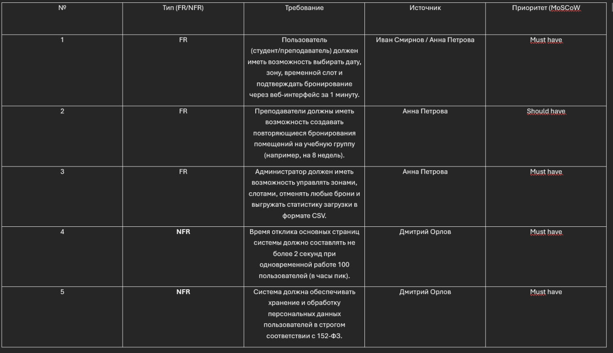
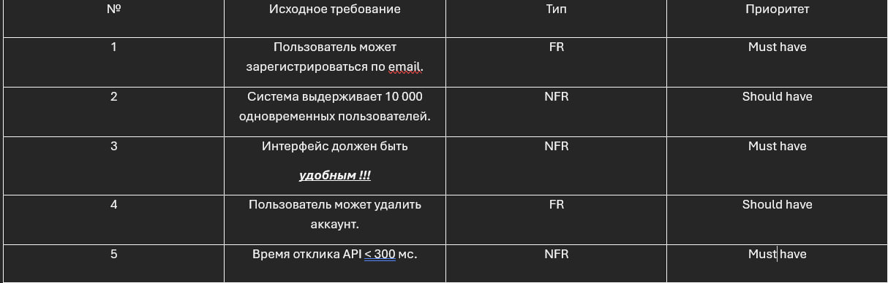

### задание 1

### задание 2

Какое требование сформулировано плохо и как его переписать?

Ответ: "Интерфейс должен быть «удобным"

Почему? Понятие является субъективным, размытым

Как переписать? Пользователь может завершить процесс регистрации нового аккаунта не более чем за 3 клика

### задание 3

#1
веб-сервис предназначен для того, чтобы автоматизировать бронирование мест, зон и переговорных комнат в коворкинге Точка кипения. Система должна избавить администраторов от рутинной работы в таблицах и сделать учет пространства полностью прозрачным для всех

#2
Цели создания:

1) Полностью убрать проблему накладок и двойных броней

2) Добиться того, чтобы как минимум 80% бронирований проходило полностью автоматически  без участия администратора

3) Сократить время, которое тратится на оформление одной брони с 10 минут до 1

4) Собирать понятную статистику по загруженности коворкинга

#3
Функциональные требования:

1) Пользователь может просматривать доступные слоты по датам, зонам и фильтровать их по оборудованию

2) Пользователь может забронировать свободное время и получить подтверждение на email

3) В личном кабинете можно посмотреть историю броней и отменить свою бронь (не позже чем за 2 часа до начала)

4) Преподаватель может создавать повторяющиеся бронирования на группу

5) Администратор может управлять зонами и слотами, отменять любые брони и выгружать CSV-отчеты по загрузке

#4
Нефункциональные требования:

Производительность: Страницы должны открываться не дольше чем за 2 секунды при одновременной работе 100 пользователей

Надежность: Стабильная работа системы в учебное время (с 8:00 до 22:00) с доступностью 99,5% и ежедневным бэкапом базы данных

Безопасность: Персональные данные пользователей обрабатываются по требованиям 152-ФЗ

#5
Ограничения
Бизнес-ограничения: Бронь не больше чем на 4 часа подряд. У одного студента максимум 2 активные брони. Бронирование доступно с 8:00 до 22:00

Технические ограничения: Веб-приложение с адаптивкой под телефоны, работа в браузерах Chrome, Firefox, Safari и Edge. Размещение на серверах вуза, СУБД — PostgreSQL. Срок — 3 месяца, команда — 4 человека

#6
Критерии приёмки: Онлайн-оплата, интеграция с турникетами, мобильное приложение и датчики

### Задание 4

#1
User Story (Администратор): Как администратор коворкинга, я хочу выгружать статистику загрузки в формате CSV и управлять слотами, чтобы контролировать посещаемость и планировать работу пространства

Критерии приемки:

Кнопка выгрузки формирует корректный CSV-файл со списком всех броней за выбранный период

Администратор может принудительно отменить любую бронь при необходимости

#2
User Story (Преподаватель): Как преподаватель, я хочу создавать повторяющиеся бронирования помещений на учебную группу на несколько недель вперед, чтобы не оформлять каждое занятие вручную

Критерии приемки:

Есть возможность выбрать период повторяемости (например, еженедельно на 8 недель)

Система проверяет доступность слотов на весь указанный период перед созданием броней

#3
User Story (СТУДЕНТ): Как студент, я хочу выбирать дату, зону и свободный временной слот через веб-интерфейс, чтобы забронировать место быстрее чем за 1 минуту

Критерии приемки:

Отображаются только актуальные и свободные слоты

После подтверждения бронирования слот сразу блокируется для других пользователей

На email пользователя приходит письмо-подтверждение