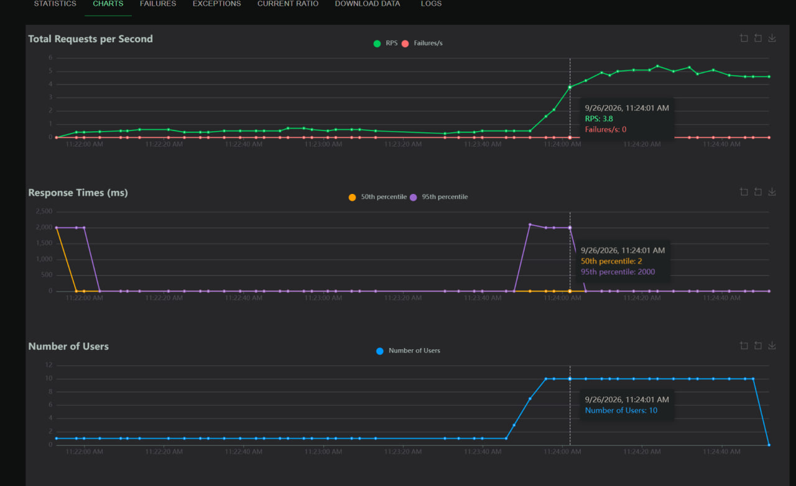
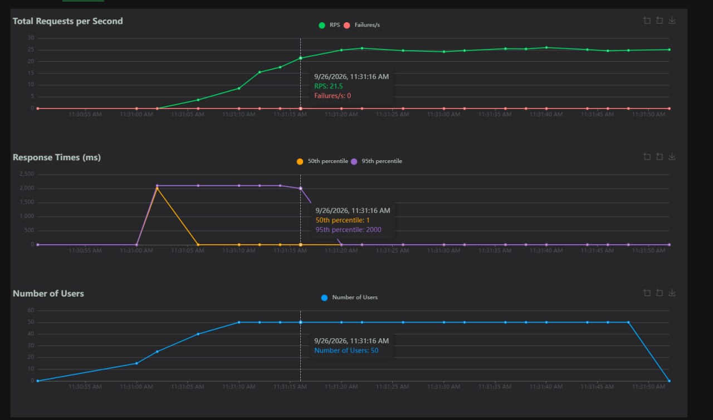
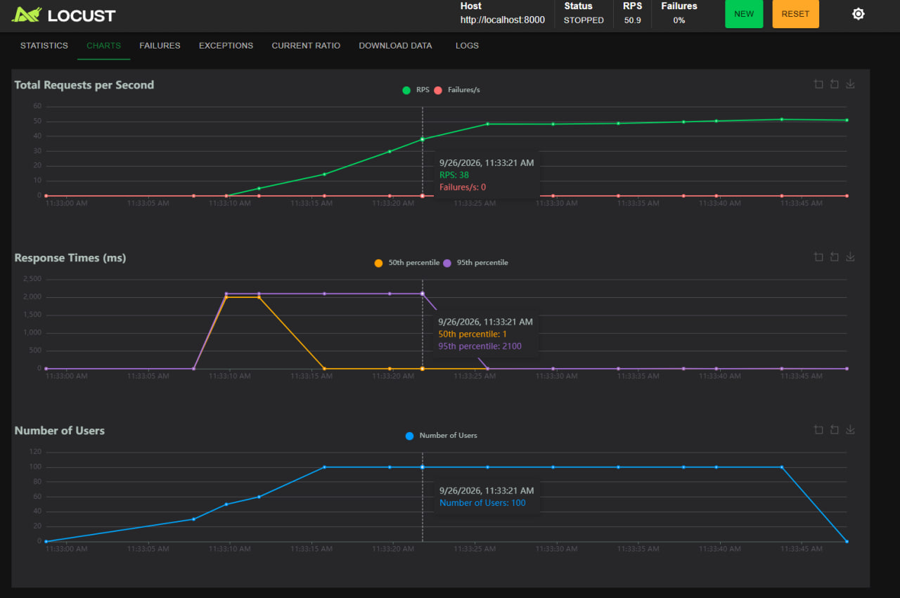
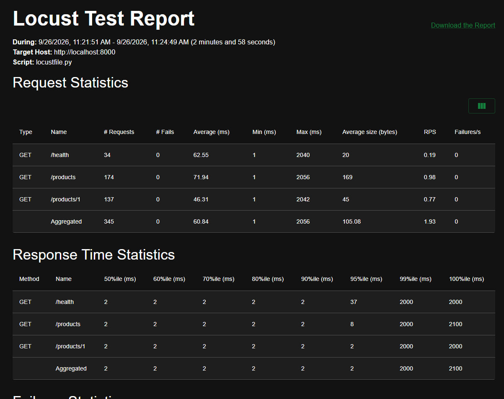
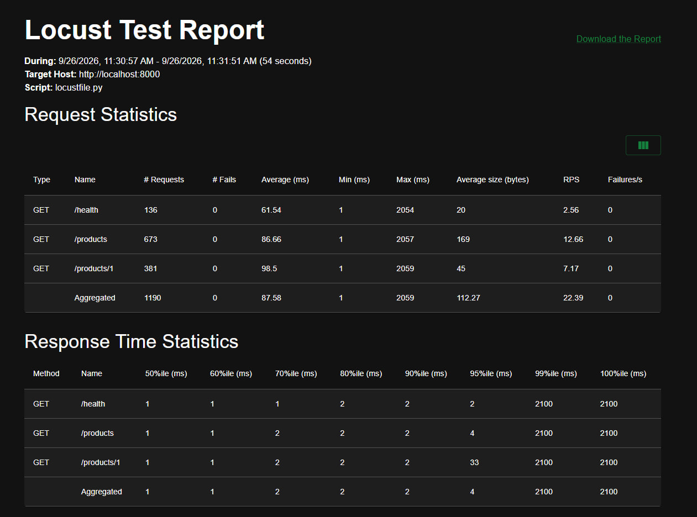
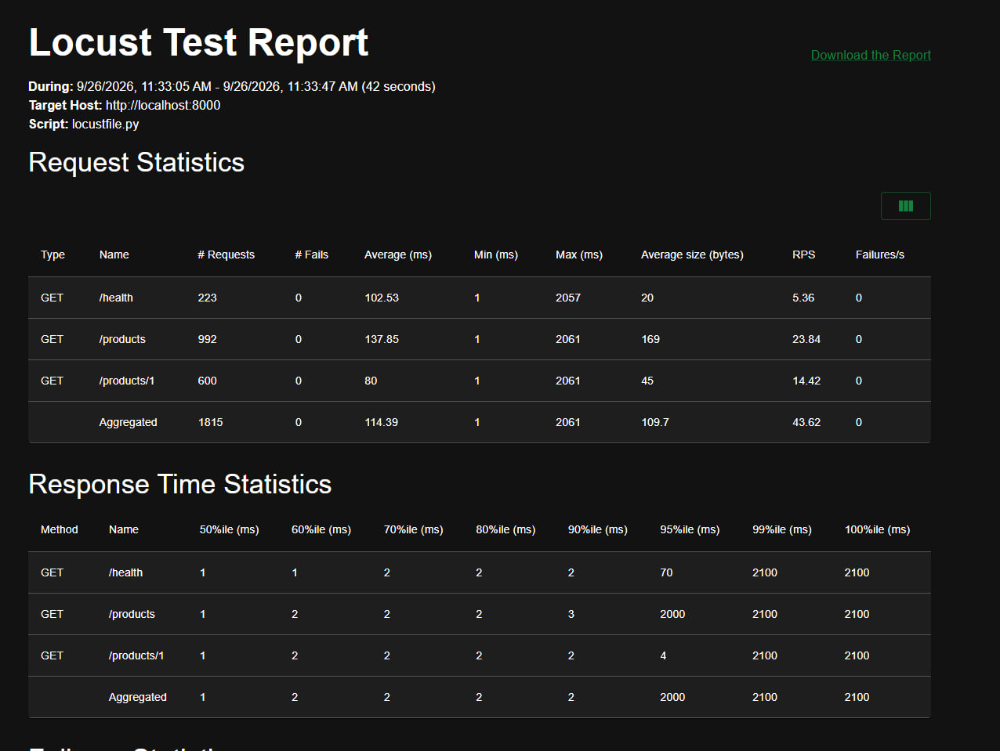

# 4

## Описание сервиса

* `GET /health` — проверка работоспособности сервиса.
* `GET /products` — получение списка продуктов.
* `GET /products/1` — получение информации по конкретному продукту.

## 3. Графики (Вкладка Charts)

### Таблицы с метриками (Request & Response Time Statistics)

1) При 10 пользователях суммарный RPS получается примерно 1.93. Если смотреть по отдельным эндпоинтам, то для /health выходит около 0.19 RPS, для /products — 0.98 RPS, а для /products/1 — 0.77 RPS.

2) Задержки начинают расти практически сразу, на этапе старта теста. При 10 пользователях уже на графиках проскакивают скачки времени отклика до 2000 мс.

3) Первыми летят p95 и p99, сразу упираются в те же 2 секунды. А медиана (p50) остается мелкой и держится в районе 2 миллисекунд. То есть обычные запросы проходят быстро, а редкие хвостовые подтормаживают из-за конкуренции за ресурсы

4) Ошибок нет.

