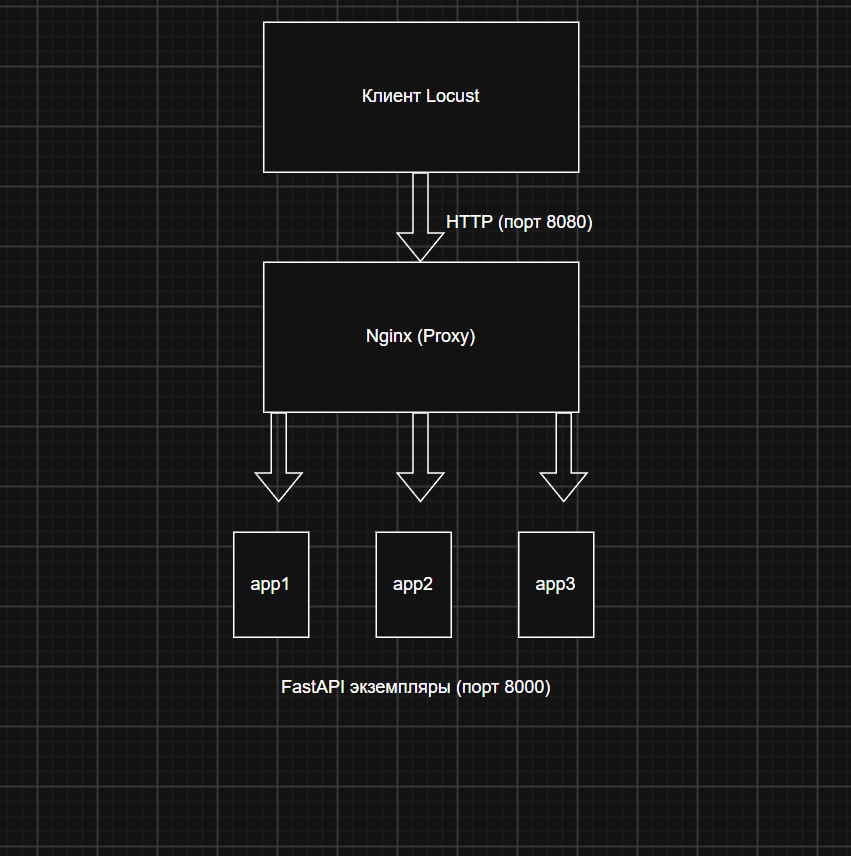

1) 

2) .

3) 

5aa4fdf2912e
23e6f3f8df8c
df5163c0b83c
5aa4fdf2912e

4) 
{"service":"highload-shop","instance":"23e6f3f8df8c","status":"running","timestamp":"2026-09-29T07:36:34.631779"}
{"service":"highload-shop","instance":"23e6f3f8df8c","status":"running","timestamp":"2026-09-29T07:36:34.645507"}
{"service":"highload-shop","instance":"df5163c0b83c","status":"running","timestamp":"2026-09-29T07:36:34.659105"}
{"service":"highload-shop","instance":"23e6f3f8df8c","status":"running","timestamp":"2026-09-29T07:36:39.676150"}

После остановки одного из контейнеров его идентификатор исчез из ответов сервера. Nginx автоматически исключил неработающий узел из пула и без ошибок перенаправил весь трафик на оставшиеся рабочие реплики.

5) 
| Метрика | Работа №1 (напрямую, порт 8000) | Работа №2 (через Nginx, порт 8080) |
| :--- | :--- | :--- |
| **RPS при 10 пользователях** | 3.8 RPS | 4.8 — 5.3 RPS |
| **RPS при 50 пользователях** | 21.5 RPS | 25.5 RPS |
| **RPS при 100 пользователях** | 38.0 RPS | 48.9 — 50.9 RPS |
| **p95 latency** | 2000 — 2100 ms | 2 — 3 ms |

6) 
* **Пропускная способность (RPS):** Выросла с 38 до ~50 RPS при 100 пользователях благодаря распределению задач между тремя репликами.
* **Время отклика (Latency):** p95 снизилась с критических 2000+ мс (очереди на одном инстансе) до стабильных 2–3 мс через Nginx.